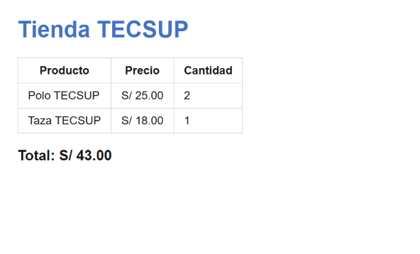

# Guía de Uso y Documentación: Tienda TECSUP (Laboratorio 03)

Este documento detalla la estructura, funcionamiento y consideraciones técnicas del proyecto **Tienda TECSUP**, desarrollado como parte de las prácticas del curso. Está diseñado para que cualquier compañero pueda comprender el propósito del código y su correcta implementación.

## Estructura del Repositorio y Componentes

El proyecto se compone de tres archivos principales organizados de la siguiente manera:

| Archivo       | Tipo                | Descripción                                                                                                          |
| :------------ | :------------------ | :------------------------------------------------------------------------------------------------------------------- |
| `index.html`  | Estructura / HTML   | Define la maquetación semántica de la página, incluyendo la tabla de productos y el contenedor del precio total.     |
| `estilos.css` | Estilos / CSS       | Aplica las reglas visuales de diseño, tipografía corporativa y bordes limpios para la tabla y encabezados.           |
| `script.js`   | Lógica / JavaScript | Contiene el arreglo de productos y la función iterativa para calcular de forma dinámica el monto total de la compra. |

## Instrucciones de Instalación y Uso

Para poner en marcha este proyecto de manera local en tu equipo, seguí los pasos detallados a continuación:

1. Cloná este repositorio en tu máquina utilizando la terminal con el comando `git clone <url-del-repositorio>`.
2. Navegá hacia la carpeta del proyecto utilizando el comando `cd Lab03`.
3. Abrí la carpeta completa en tu entorno de desarrollo favorito ejecutando `code .` para iniciar Visual Studio Code.
4. Iniciá un servidor local (como la extensión _Live Server_) o abrí directamente el archivo `index.html` en tu navegador web preferido.

### Tareas del Proyecto

- [x] Maquetar la tabla de productos y el identificador de total en HTML.
- [x] Configurar los estilos visuales y colores institucionales en CSS.
- [x] Programar la función de cálculo automático de precios en JavaScript.

## Ejemplo de Lógica y Bloque de Código

El siguiente bloque extraído de `script.js` muestra cómo se implementa la función iterativa que recorre la lista de productos y acumula los precios utilizando el comando en línea `producto.precio`:

```javascript
const productos = [
  { nombre: "Polo TECSUP", precio: 25.0, cantidad: 2 },
  { nombre: "Taza TECSUP", precio: 18.0, cantidad: 1 },
];

function calcularTotal(lista) {
  let total = 0;
  for (const producto of lista) {
    total = total + producto.precio;
  }
  return total;
}
```


